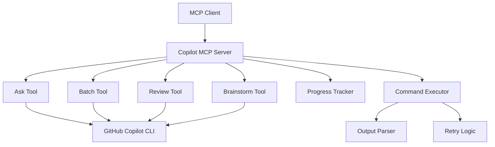

# Copilot MCP Server

[](https://github.com/x51xxx/copilot-mcp-server/actions)
[](https://codecov.io/gh/x51xxx/copilot-mcp-server)
[](https://hub.docker.com/r/x51xxx/copilot-mcp-server)
[](https://opensource.org/licenses/MIT)

A production-ready MCP (Model Context Protocol) server for GitHub Copilot CLI integration with full TypeScript support, comprehensive testing, and Docker containerization.

## 🚀 Features

- **🤖 Four Core MCP Tools**: Ask, Batch, Review, and Brainstorm
- **🔄 Robust Execution**: Command executor with retry logic and exponential backoff
- **📊 Progress Tracking**: Real-time progress monitoring for long-running operations  
- **🔍 Output Parsing**: Intelligent parsing of GitHub Copilot CLI responses
- **📝 TypeScript**: Full type safety with strict mode enabled
- **🧪 Comprehensive Testing**: Unit and integration tests with high coverage
- **🐳 Docker Support**: Multi-stage builds for production deployment
- **📖 Rich Documentation**: VitePress-powered documentation site
- **⚡ GitHub Actions**: Automated testing and release workflows

## 📋 Prerequisites

- **Node.js** 18+ 
- **GitHub CLI** (`gh`) installed and authenticated
- **GitHub Copilot** subscription and CLI access

## 🛠️ Installation

### NPM Package
```bash
npm install -g copilot-mcp-server
```

### Docker
```bash
docker run -d \
  --name copilot-mcp-server \
  -e GITHUB_TOKEN=$GITHUB_TOKEN \
  ghcr.io/x51xxx/copilot-mcp-server:latest
```

### From Source
```bash
git clone https://github.com/x51xxx/copilot-mcp-server.git
cd copilot-mcp-server
npm install
npm run build
npm start
```

## 🚀 Quick Start

### Basic Usage
```typescript
import { CopilotMCPServer } from 'copilot-mcp-server';

const server = new CopilotMCPServer({
  copilot: {
    cliPath: 'gh',
    timeout: 30000,
  },
  logging: {
    level: 'info',
  },
});

await server.start();
```

### Using the Ask Tool
```typescript
// Ask GitHub Copilot for help
const result = await askTool.execute({
  query: 'How do I implement error handling in Express.js?',
  language: 'typescript',
  context: 'Building a REST API',
});
```

### Batch Operations
```typescript
// Run multiple tasks with dependencies
const result = await batchTool.execute({
  tasks: [
    {
      id: 'setup',
      name: 'Setup Express',
      query: 'How to set up Express.js with TypeScript?',
    },
    {
      id: 'middleware',
      name: 'Add Middleware', 
      query: 'How to add error handling middleware?',
      dependencies: ['setup'],
    },
  ],
  parallel: false,
});
```

## 🔧 MCP Tools

### 1. Ask Tool
Execute GitHub Copilot CLI commands with context and language hints.

```json
{
  "name": "ask",
  "arguments": {
    "query": "How do I optimize database queries?",
    "language": "sql",
    "context": "PostgreSQL performance tuning"
  }
}
```

### 2. Batch Tool  
Run multiple tasks sequentially or in parallel with dependency management.

```json
{
  "name": "batch", 
  "arguments": {
    "tasks": [
      {
        "id": "task1",
        "name": "Database Setup",
        "query": "How to set up PostgreSQL with Docker?"
      },
      {
        "id": "task2", 
        "name": "Connection Pool",
        "query": "How to configure connection pooling?",
        "dependencies": ["task1"]
      }
    ],
    "parallel": false
  }
}
```

### 3. Review Tool
Perform automated code reviews with customizable focus areas.

```json
{
  "name": "review",
  "arguments": {
    "files": ["./src/api/users.ts", "./src/models/user.ts"],
    "focusAreas": ["security", "performance"],
    "language": "typescript"
  }
}
```

### 4. Brainstorm Tool
Generate creative ideas and solutions using various brainstorming techniques.

```json
{
  "name": "brainstorm",
  "arguments": {
    "topic": "Improving API response times",
    "context": "E-commerce platform with 10M+ users",
    "constraints": ["Budget: $100k", "Timeline: 6 months"],
    "ideaCount": 8,
    "creativityLevel": "balanced"
  }
}
```

## 🏗️ Architecture



## ⚙️ Configuration

### Environment Variables
```bash
# Server Configuration
MCP_SERVER_NAME=copilot-mcp-server
MCP_SERVER_VERSION=1.0.0

# GitHub Copilot CLI Configuration  
COPILOT_CLI_PATH=gh
COPILOT_TIMEOUT=30000
COPILOT_MAX_RETRIES=3
COPILOT_RETRY_DELAY=1000

# Logging Configuration
LOG_LEVEL=info  # debug, info, warn, error
LOG_FORMAT=pretty  # pretty, json
```

### Configuration File
```typescript
const config: Config = {
  server: {
    name: 'my-copilot-server',
    version: '1.0.0',
  },
  copilot: {
    cliPath: 'gh',
    timeout: 30000,
    maxRetries: 3,
    retryDelay: 1000,
  },
  logging: {
    level: 'info',
    format: 'pretty',
  },
};
```

## 🧪 Development

### Prerequisites  
```bash
# Install GitHub CLI
curl -fsSL https://cli.github.com/packages/githubcli-archive-keyring.gpg | sudo dd of=/usr/share/keyrings/githubcli-archive-keyring.gpg
echo "deb [arch=$(dpkg --print-architecture) signed-by=/usr/share/keyrings/githubcli-archive-keyring.gpg] https://cli.github.com/packages stable main" | sudo tee /etc/apt/sources.list.d/github-cli.list > /dev/null
sudo apt update
sudo apt install gh

# Authenticate
gh auth login
```

### Setup Development Environment
```bash
# Clone repository
git clone https://github.com/x51xxx/copilot-mcp-server.git
cd copilot-mcp-server

# Install dependencies
npm install

# Build project
npm run build

# Run tests
npm test

# Start development server
npm run dev

# Run examples
npm run example:basic
```

### Scripts
```bash
# Development
npm run dev          # Start with hot reload
npm run build        # Build TypeScript
npm run start        # Start production server

# Testing
npm test             # Run tests
npm run test:watch   # Watch mode
npm run test:coverage # With coverage

# Code Quality
npm run lint         # Lint code
npm run lint:fix     # Fix linting issues
npm run format       # Format code

# Documentation
npm run docs:dev     # Start docs dev server
npm run docs:build   # Build documentation
```

## 🐳 Docker

### Basic Usage
```bash
# Build image
docker build -t copilot-mcp-server .

# Run container
docker run -d \
  --name copilot-mcp-server \
  -e GITHUB_TOKEN=$GITHUB_TOKEN \
  -e LOG_LEVEL=info \
  copilot-mcp-server
```

### Docker Compose
```yaml
version: '3.8'
services:
  copilot-mcp-server:
    build: .
    environment:
      - LOG_LEVEL=info
      - GITHUB_TOKEN=${GITHUB_TOKEN}
    restart: unless-stopped
```

## 📚 Documentation

Visit our [comprehensive documentation](https://x51xxx.github.io/copilot-mcp-server) for:

- **📖 Getting Started Guide** - Step-by-step setup instructions
- **🔧 Configuration Reference** - All configuration options
- **🛠️ API Documentation** - Complete tool reference
- **💡 Examples** - Real-world usage examples
- **🏗️ Architecture Guide** - Internal design and architecture

## 📊 Testing

### Run Tests
```bash
# Unit tests
npm test

# Integration tests  
npm run test:integration

# Coverage report
npm run test:coverage

# Watch mode
npm run test:watch
```

### Test Structure
```
src/test/
├── unit/           # Unit tests
│   ├── tools/      # Tool tests
│   ├── utils/      # Utility tests
│   └── services/   # Service tests
├── integration/    # Integration tests
└── setup.ts        # Test configuration
```

## 🤝 Contributing

We welcome contributions! Please see our [Contributing Guide](CONTRIBUTING.md) for details.

### Development Workflow
1. Fork the repository
2. Create a feature branch (`git checkout -b feature/amazing-feature`)
3. Make your changes
4. Add tests for new functionality
5. Ensure all tests pass (`npm test`)
6. Commit your changes (`git commit -m 'Add amazing feature'`)
7. Push to the branch (`git push origin feature/amazing-feature`)
8. Open a Pull Request

## 📄 License

This project is licensed under the MIT License - see the [LICENSE](LICENSE) file for details.

## 🙏 Acknowledgments

- **GitHub Copilot Team** - For the amazing AI-powered development tools
- **MCP Protocol Team** - For the Model Context Protocol specification
- **TypeScript Team** - For the excellent type system
- **Node.js Community** - For the robust runtime environment

## 📞 Support

- **📖 Documentation**: [https://x51xxx.github.io/copilot-mcp-server](https://x51xxx.github.io/copilot-mcp-server)
- **🐛 Issues**: [GitHub Issues](https://github.com/x51xxx/copilot-mcp-server/issues)
- **💬 Discussions**: [GitHub Discussions](https://github.com/x51xxx/copilot-mcp-server/discussions)

---

<div align="center">

**[Documentation](https://x51xxx.github.io/copilot-mcp-server)** •
**[Examples](./examples/)** •
**[API Reference](https://x51xxx.github.io/copilot-mcp-server/api/)** •
**[Contributing](CONTRIBUTING.md)**

Made with ❤️ by [Taras Trishchuk](https://github.com/x51xxx)

</div>