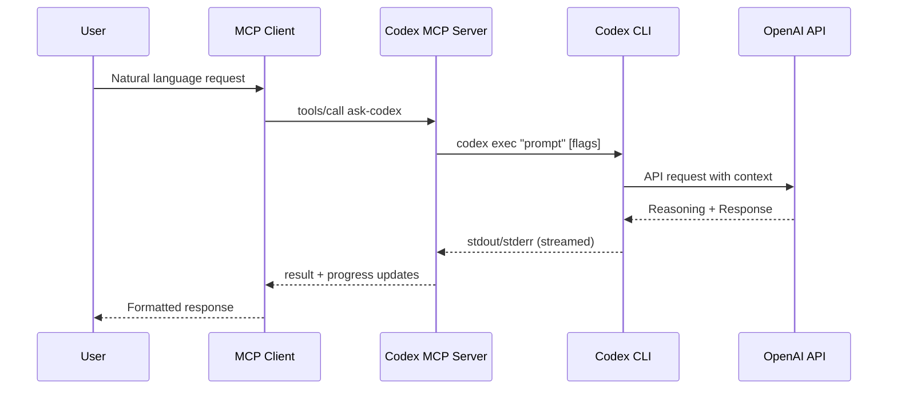

# How It Works

The Codex MCP Tool acts as a bridge between MCP-compatible clients (like Claude Desktop or Claude Code) and the Codex CLI, enabling seamless integration of OpenAI's powerful code analysis and generation capabilities into your development workflow.

## Architecture Overview

The system consists of three main components working together:



## Core Components

### 1. MCP Client
The user-facing interface that supports the Model Context Protocol:
- **Claude Desktop/Code**: Primary clients with full MCP support
- **Cursor, Windsurf**: IDE integrations
- **Custom Clients**: Any application implementing MCP protocol

### 2. Codex MCP Server (This Tool)
The middleware that translates between MCP and Codex CLI:
- **Protocol Translation**: Converts MCP tool calls to CLI commands
- **Process Management**: Spawns and manages Codex CLI processes
- **Stream Processing**: Handles stdout/stderr streaming
- **Progress Tracking**: Sends periodic updates to prevent timeouts
- **Error Handling**: Gracefully manages failures and retries

### 3. Codex CLI
OpenAI's command-line interface for code operations:
- **Non-interactive Mode**: Runs via `codex exec` for automation
- **File Context**: Processes `@` references to include files
- **Model Selection**: Routes to appropriate AI model
- **Sandbox Execution**: Manages security and approval policies

## Request Flow

### Step 1: User Invocation
Users can invoke the tool through multiple methods:
```javascript
// Natural language in Claude
"use codex to analyze @src/main.ts"

// Direct tool call
/codex-cli:ask-codex @README.md summarize this file

// Programmatic invocation
{
  "name": "ask-codex",
  "arguments": {
    "prompt": "review @src/**/*.ts",
    "model": "gpt-5"
  }
}
```

### Step 2: MCP Protocol Processing
The MCP server receives the standardized tool call:
```json
{
  "jsonrpc": "2.0",
  "method": "tools/call",
  "params": {
    "name": "ask-codex",
    "arguments": {
      "prompt": "analyze @src/utils",
      "model": "gpt-5",
      "fullAuto": true
    }
  }
}
```

### Step 3: CLI Command Construction
The server builds the appropriate Codex CLI command:
```bash
codex exec \
  --model gpt-5 \
  --full-auto \
  "analyze @src/utils"
```

### Step 4: Process Execution
The server spawns a child process with:
- Environment variables from current context
- Working directory configuration
- Stream handlers for stdout/stderr
- Timeout management

### Step 5: Response Streaming
Real-time output is captured and forwarded:
```javascript
// Progress notifications every 25 seconds
{
  "progress": 50,
  "total": 100,
  "status": "Analyzing files..."
}

// Final result
{
  "content": [
    {
      "type": "text",
      "text": "Analysis complete: [detailed results]"
    }
  ]
}
```

## Advanced Features

### Progress Notifications
To prevent timeouts during long-running operations:
```javascript
class TimeoutManager {
  startOperation() {
    this.interval = setInterval(() => {
      sendProgress({
        status: "Processing...",
        elapsed: Date.now() - this.startTime
      });
    }, 25000); // Every 25 seconds
  }
}
```

### Change Mode (Structured Edits)
For code modifications, the server can request structured output:

1. **Request with changeMode**:
```javascript
{
  "prompt": "update all console.log to use winston",
  "changeMode": true
}
```

2. **Parse OLD/NEW blocks**:
```
=== FILE: src/utils.js ===
OLD:
console.log('Debug message');
NEW:
winston.debug('Debug message');
```

3. **Chunk large responses**:
- Split into manageable chunks
- Cache with unique key
- Return first chunk immediately
- Fetch remaining via `fetch-chunk` tool

### Error Handling

The server implements robust error handling:

```javascript
try {
  const result = await executeCodexCLI(prompt, options);
  return processResult(result);
} catch (error) {
  if (error.code === 'TIMEOUT') {
    return handleTimeout(error);
  } else if (error.code === 'INVALID_MODEL') {
    return suggestAlternativeModel(error);
  } else {
    return formatErrorResponse(error);
  }
}
```

## Configuration Management

### Environment Variables
```bash
# Model defaults
CODEX_DEFAULT_MODEL=gpt-5

# Timeout settings
MCP_OPERATION_TIMEOUT=600000  # 10 minutes

# Debug mode
DEBUG=codex-mcp:*
```

### Codex CLI Flags
The server supports all Codex CLI flags:

| Flag | MCP Parameter | Description |
|------|---------------|-------------|
| `--model` | `model` | AI model selection |
| `--full-auto` | `fullAuto` or `sandbox` | Automatic execution mode |
| `--ask-for-approval` | `approvalPolicy` | Approval requirements |
| `--sandbox` | `sandboxMode` | Filesystem access level |
| `--cd` | `cd` | Working directory |
| `--dangerously-bypass-approvals-and-sandbox` | `yolo` | Bypass all safety checks |

## Performance Optimization

### Streaming for Large Output
Instead of buffering entire responses:
```javascript
const proc = spawn('codex', args);
proc.stdout.on('data', (chunk) => {
  // Stream directly to client
  onProgress?.(chunk.toString());
});
```

### Caching for Repeated Queries
The server implements smart caching:
- File content caching (15-minute TTL)
- Model response caching for identical prompts
- Chunk caching for pagination

### Parallel Tool Execution
Multiple tools can run concurrently:
```javascript
await Promise.all([
  askCodex({ prompt: "analyze @src" }),
  brainstorm({ prompt: "optimization ideas" }),
  ping({ message: "test" })
]);
```

## Security Considerations

### Sandbox Isolation
All file operations respect Codex's sandbox settings:
- **read-only**: No filesystem writes
- **workspace-write**: Write only in working directory
- **danger-full-access**: Full filesystem access (use with caution)

### Input Validation
All inputs are validated using Zod schemas:
```javascript
const schema = z.object({
  prompt: z.string().min(1),
  model: z.enum(['gpt-5', 'o3', 'o4-mini']).optional(),
  sandbox: z.boolean().optional()
});
```

### Process Isolation
Each request runs in an isolated child process:
- No shared state between requests
- Clean environment for each execution
- Automatic cleanup on completion

## Troubleshooting

### Common Issues

#### Timeout Errors
- Increase timeout: Set `timeout` parameter
- Break into smaller tasks
- Use progress callbacks

#### Model Not Available
- Check Codex CLI configuration
- Verify API credentials
- Try alternative model

#### File Not Found
- Verify working directory
- Check relative paths
- Use absolute paths when needed

### Debug Mode
Enable detailed logging:
```bash
DEBUG=codex-mcp:* npm start
```

### Health Checks
Test connectivity:
```javascript
// Ping test
{ "name": "ping", "arguments": { "message": "test" } }

// Help command
{ "name": "help", "arguments": {} }
```

## Integration Examples

### With Claude Code
```bash
# One-time setup
claude mcp add codex-cli -- npx -y @trishchuk/codex-mcp-tool

# Usage
claude
> use codex to analyze my project
```

### With Custom MCP Client
```javascript
const client = new MCPClient({
  servers: {
    'codex-cli': {
      command: 'npx',
      args: ['-y', '@trishchuk/codex-mcp-tool']
    }
  }
});

await client.callTool('ask-codex', {
  prompt: 'analyze @src',
  model: 'gpt-5'
});
```

## See Also

- [File Analysis](./file-analysis.md) - Using the @ syntax effectively
- [Model Selection](./models.md) - Choosing the right AI model
- [Sandbox Modes](./sandbox.md) - Security and approval configurations
- [Codex CLI Documentation](../codex-cli-getting-started.md) - Underlying CLI reference