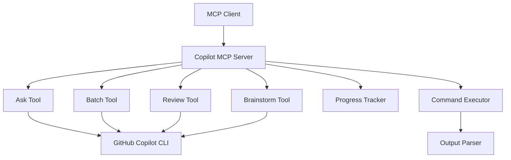

# Copilot MCP Server

A production-ready MCP (Model Context Protocol) server for GitHub Copilot CLI integration.

## Features

- 🤖 **Four Core Tools**: Ask, Batch, Review, and Brainstorm
- 🔄 **Retry Logic**: Robust command execution with automatic retries
- 📊 **Progress Tracking**: Real-time progress monitoring for long-running operations
- 🐳 **Docker Support**: Ready for containerized deployments
- 📝 **TypeScript**: Full type safety with strict mode
- 🧪 **Comprehensive Testing**: Unit and integration tests
- 📖 **Rich Documentation**: Complete guides and API reference

## Quick Start

```bash
# Install dependencies
npm install

# Build the project
npm run build

# Start the server
npm start
```

## MCP Tools

### Ask Tool
Execute GitHub Copilot CLI commands with context and language hints.

### Batch Tool
Run multiple tasks sequentially or in parallel with dependency management.

### Review Tool
Perform automated code reviews with customizable focus areas.

### Brainstorm Tool
Generate creative ideas and solutions using various brainstorming techniques.

## Architecture



## Getting Started

1. [Installation Guide](./guide/installation.md)
2. [Configuration](./guide/configuration.md)
3. [Basic Usage](./examples/basic-usage.md)

## API Reference

Explore the complete API documentation:

- [Tools Overview](./api/tools.md)
- [Configuration Types](./api/configuration.md)
- [Progress Tracking](./api/progress.md)